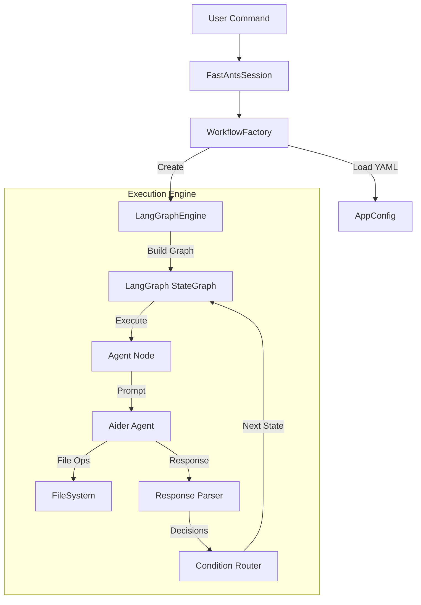

# FastAnts: Lightweight Multi-Agent Orchestration for Local Developers

[](https://opensource.org/licenses/MIT)
[](https://www.python.org/downloads/)
[](https://langchain-ai.github.io/langgraph/)
[](https://github.com/paul-gauthier/aider)

[中文文档 (Chinese Documentation)](README_CN.md)

**FastAnts** is a lightweight, easy-to-use Multi-Agent System (MAS) framework designed for individual developers to run locally. It orchestrates multiple **Aider** agents to collaborate on complex software engineering tasks using simple YAML configuration files.

By leveraging **LangGraph** for state management and **Aider** for powerful coding capabilities, FastAnts allows you to define and run custom multi-agent workflows (like "Client vs Supplier" or "Architect vs Coder") right on your machine.

> **Philosophy**: "Simple YAML, Powerful Agents."

## 🚀 Key Features

- **YAML-Driven Workflows**: Define complex agent interactions and logic using simple, declarative YAML files. No complex Python code required.
- **Local & Private**: Designed to run locally on your machine. You control the environment and the data.
- **Aider Integration**: Harnesses the proven coding power of Aider agents.
- **Multi-Agent Collaboration**: Orchestrate multiple specialized agents (e.g., Architect, Coder, Reviewer) to work together on a shared codebase.
- **State Management**: Built on **LangGraph**, ensuring robust state transitions and conditional routing.
- **"Keep-Alive" Sessions**: Maintain agent context and workspace state across multiple workflow steps.

## 🛠️ Installation

1. **Clone the Repository**
   ```bash
   git clone https://github.com/sherkevin/FastAnts.git
   cd FastAnts
   ```

2. **Install Dependencies**
   ```bash
   pip install -r src/requirements.txt
   ```

3. **Configuration**
   Create a `.env` file in the `src` directory (or root) with your LLM API keys:
   ```bash
   OPENAI_API_KEY=sk-...
   OPENAI_API_BASE=https://api.openai.com/v1  # Optional
   AIDER_MODEL=gpt-4-turbo
   ```

## 🏃 Usage

The framework is designed to be run as a module.

### List Available Workflows
Check which workflows are currently registered in the system:
```bash
python -m src.main --list
```

### Run a Workflow
Execute a specific workflow (e.g., `hulatang` or `collaboration`):
```bash
python -m src.main --run hulatang
```

### Default Run
Running without arguments executes the default workflow (usually `collaboration`):
```bash
python -m src.main
```

## 📘 Workflow Engineering Guide

The core of FastAnts is the **Workflow Template**. This YAML file defines *who* the agents are, *what* they do, and *how* they interact.

For a comprehensive guide on how to write valid `workflow.yaml` files, including state machine logic, condition syntax, and best practices, please refer to the dedicated documentation:

👉 **[FastAnts Workflow Engineering Guide](docs/WORKFLOW_GUIDE.md)**

### Quick Start Template

```yaml
name: "my_workflow"
description: "A simple example"
initial_message: "Do something"
max_turns: 10

agents:
  - name: "coder"
    type: "coder"

states:
  - name: "start"
    agent: "coder"
    start: true
    prompt: |
      Goal: {{initial_message}}
      {{COLLABORATION_GUIDE}}
      Reply with JSON.
    transitions:
      - to: "END"
        condition: "true"
```

## 🏗️ Architecture



## 🤝 Contributing

Contributions are welcome! Please read our [Contributing Guide](CONTRIBUTING.md) for details on our code of conduct and the process for submitting pull requests.

## 📄 License

This project is licensed under the MIT License - see the [LICENSE](LICENSE) file for details.
