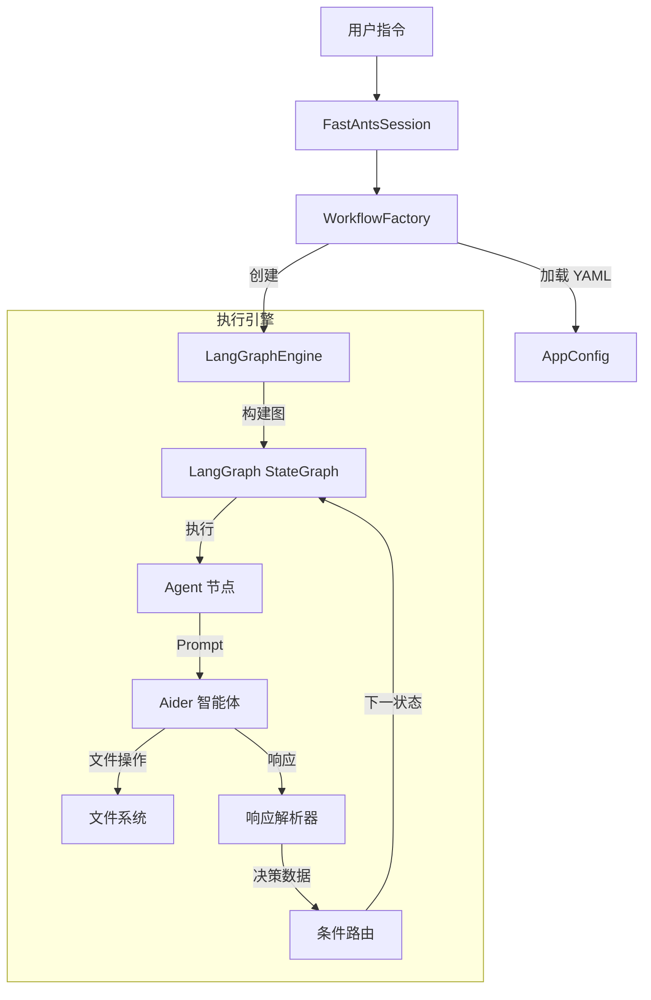

# FastAnts: 个人开发者的轻量级多智能体编排框架

[](https://opensource.org/licenses/MIT)
[](https://www.python.org/downloads/)
[](https://langchain-ai.github.io/langgraph/)
[](https://github.com/paul-gauthier/aider)

[English Documentation](README.md)

**FastAnts** 是一个轻量级、易于使用的多智能体系统 (MAS) 框架，专为个人开发者本地运行而设计。它通过简单的 YAML 配置文件，编排多个 **Aider** 智能体协同完成复杂的软件工程任务。

利用 **LangGraph** 进行状态管理，结合 **Aider** 强大的编码能力，FastAnts 让您可以在本地机器上定义和运行自定义的多智能体工作流（如“甲方 vs 乙方”或“架构师 vs 开发者”）。

> **核心理念**：“YAML 定义流程，Agent 负责实现。”

## 🚀 核心特性

- **YAML 驱动工作流**：使用简单、声明式的 YAML 文件定义复杂的智能体交互和逻辑。无需编写复杂的 Python 代码。
- **本地与私有**：专为本地运行设计。您完全掌控环境和数据。
- **集成 Aider 能力**：充分利用 Aider 智能体经过验证的强大编码能力。
- **多智能体协作**：编排多个专业角色的智能体（如架构师、开发者、评审员）在共享代码库上协同工作。
- **状态管理**：基于 **LangGraph** 构建，确保稳健的状态流转和条件路由。
- **会话保持 (Keep-Alive)**：支持跨多个工作流步骤保持智能体上下文和工作区状态。

## 🛠️ 安装指南

1. **克隆仓库**
   ```bash
   git clone https://github.com/sherkevin/FastAnts.git
   cd FastAnts
   ```

2. **安装依赖**
   ```bash
   pip install -r src/requirements.txt
   ```

3. **配置环境**
   在 `src` 目录（或根目录）下创建 `.env` 文件，配置 LLM API 密钥：
   ```bash
   OPENAI_API_KEY=sk-...
   OPENAI_API_BASE=https://api.openai.com/v1  # 可选
   AIDER_MODEL=gpt-4-turbo
   ```

## 🏃 使用方法

本框架设计为以模块方式运行。

### 列出可用工作流
查看当前系统中已注册的工作流：
```bash
python -m src.main --list
```

### 运行指定工作流
执行特定的工作流（例如 `hulatang` 或 `collaboration`）：
```bash
python -m src.main --run hulatang
```

### 默认运行
不带参数运行将执行默认工作流（通常是 `collaboration`）：
```bash
python -m src.main
```

## 📘 工作流工程指南 (Workflow Engineering)

FastAnts 的核心是 **工作流模板 (Workflow Template)**。这个 YAML 文件定义了智能体是 *谁*，它们 *做* 什么，以及它们 *如何* 交互。

关于如何编写有效的 `workflow.yaml` 文件（包括状态机逻辑、条件语法和最佳实践）的详细指南，请参阅专用文档：

👉 **[FastAnts 工作流工程指南](docs/WORKFLOW_GUIDE_CN.md)**

### 快速开始模板

```yaml
name: "my_workflow"
description: "一个简单的示例"
initial_message: "做点什么"
max_turns: 10

agents:
  - name: "coder"
    type: "coder"

states:
  - name: "start"
    agent: "coder"
    start: true
    prompt: |
      目标：{{initial_message}}
      {{COLLABORATION_GUIDE}}
      请回复 JSON。
    transitions:
      - to: "END"
        condition: "true"
```

## 🏗️ 架构概览



## 🤝 贡献

欢迎贡献！请阅读我们的 [贡献指南](CONTRIBUTING.md) 了解行为准则和提交 Pull Request 的流程。

## 📄 许可证

本项目采用 MIT 许可证 - 详情请参阅 [LICENSE](LICENSE) 文件。
